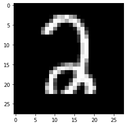

# Digit Recognizer 
This is my first notebook written after completing a deep learning course online. The notebook addresses the "Digit Recognizer" competition on Kaggle, using the MNIST dataset to predict digits from images.

## Problem Statement

Given an image, the goal is to predict the digit it represents. For instance, given the image below, the model should predict the digit '2'.

## Solution Approach
### Tools and Libraries Used
- Language: Python (Jupyter Notebook)
- Libraries: NumPy, Pandas
### Neural Network Architecture
I built a neural network with a single hidden layer:
- Input: $X$ with dimensions $(\text{nPixel} \times m)$, where $\text{nPixel}$ is the number of pixels in the image, and $m$ is the number of images in the training set.
- Hidden Layer: $nUnits$ neurons with the $ReLU$ activation function.
- Output Layer: 10 neurons representing digits 0 to 9, with the softmax activation function.

### Forward Propagation

The forward propagation process can be described as follows:

1. $Z_1 = W_1 \cdot X + b_1$
2. $A_1 = \text{ReLU}(Z_1)$
3. $Z_2 = W_2 \cdot A_1 + b_2$
4. $A_2 = \text{Softmax}(Z_2)$

### Backward Propagation

The backward propagation process involves computing gradients and updating parameters:

1. $dz_2 = A_2 - Y$
2. $dw_2 = \frac{1}{m} \cdot dz_2 \cdot A_1^T$
3. $db_2 = \frac{1}{m} \cdot \text{sum}(dz_2, \text{axis}=1, \text{keepdims=True})$
4. $dz_1 = W_2^T \cdot dz_2 \cdot (\text{ReLU}'(Z_1))$
5. $dw_1 = \frac{1}{m} \cdot dz_1 \cdot X^T$
6. $db_1 = \frac{1}{m} \cdot \text{sum}(dz_1, \text{axis}=1, \text{keepdims=True})$

### Result:
Achieved an accuracy of 0.97371 on the test set

## Key Learnings from This Exercise:

1. Neural networks involve two main processes: forward propagation and backward propagation. Initially, weights are randomly initialized, and through matrix multiplication, the information passes through the network layers until it reaches the output layer. This process is known as forward propagation. Subsequently, during backward propagation, the derivatives of the weights are computed. As the derivatives propagate back to the first layer, weight updates are performed. These two processes continue iteratively until the error is within an acceptable range or the specified number of iterations is reached. To make predictions, the learned weights and biases are used in the forward propagation process.

2. The number of neurons significantly affects the model's accuracy. Initially, I built a model with 10 neurons in the hidden layer, achieving an accuracy of around 0.85. Despite adjusting the learning rate and the number of iterations, the results remained in the range of 0.85-0.87. I then decided to increase the number of neurons to 32, 64, and 128. The accuracy improved to over 0.93. In the final attempt, I chose 128 neurons, a learning rate of 0.9, and 5000 iterations, achieving an accuracy of 0.97371.

3. Normalizing data for each layer is crucial. In my initial attempt without normalization, the weight matrix (W) contained very large values (>5000), causing errors in the softmax function ($e^{5000}$ is a very large number).

